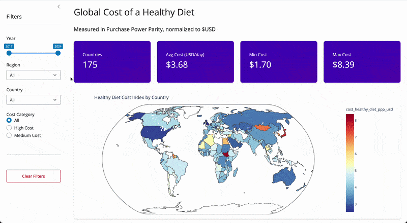

# Global Cost of a Healthy Diet Dashboard

|  |  |
|--|--|
| **Stable (Main)** | https://019ca611-b9ae-8017-9eb5-09dec8e3e055.share.connect.posit.cloud/ |
| **Preview (Dev)** | https://019ca57d-6583-da29-765f-1a716196111d.share.connect.posit.cloud/ |
| **Python** | [](https://www.python.org/downloads/) |

---

## Summary

This dashboard enables cross-country and regional comparisons of the cost of a healthy diet from 2017 to 2024 using PPP-adjusted USD. Users can explore geographic patterns on a world map, compare trends over time for selected countries, and examine regional distributions to understand disparities in affordability. The app also supports quick identification of high-cost versus low-cost contexts using the dataset's cost_category classification. Intended users include policy analysts, public health researchers, and international development organizations.

---

## Features

**Dashboard**  
Filter by year range, region, country, and cost category. Includes a Reset button to restore all defaults.
- **KPI cards**: countries count, average, min, and max daily cost
- **Choropleth map**: diet cost by country for the latest selected year, with region zoom
- **Bar chart**: average cost by region
- **Line chart**: top 10 countries with the highest cost increase over the selected period
- **Box plot**: cost distribution by region over time

**AI Chatbot**  
Ask plain-English questions to filter and explore the data. Results update a table, bar chart, and trend line in real time. Filtered data can be downloaded as CSV.

---

## Demo



---

## Local Setup

### 1. Clone

```bash
git clone https://github.com/UBC-MDS/DSCI-532_2026_29_healthy-diet.git
cd DSCI-532_2026_29_healthy-diet
```

### 2. Environment

**Conda (recommended)**
```bash
conda env create -f environment.yml
conda activate 532-healthy-diet
```

**pip**
```bash
pip install -r requirements.txt
```

### 3. API Keys

**Anthropic**: required for the AI Chatbot tab. Create `src/.env`:
```
ANTHROPIC_API_KEY=sk-ant-your-key-here
```
> Get a key at https://console.anthropic.com. The Dashboard tab works without it.

**Kaggle**: required to download the dataset on first run. Add to `~/.kaggle/kaggle.json` or set as environment variables:
```
KAGGLE_USERNAME=your-username
KAGGLE_KEY=your-key
```

### 4. Run

```bash
python -m shiny run --reload src/app.py
```

Open http://127.0.0.1:8000

---

## Deployment

On Posit Connect Cloud, set these environment variables before deploying:

| Variable | Purpose |
|---|---|
| `ANTHROPIC_API_KEY` | AI Chatbot tab |
| `KAGGLE_USERNAME` | Dataset download |
| `KAGGLE_KEY` | Dataset download |

Dependencies install automatically from `requirements.txt`.

---

## Repository Structure

```
├── environment.yml       # Conda environment (local dev)
├── requirements.txt      # Pip dependencies (deployment)
├── src/
│   ├── app.py            # Shiny application
│   ├── .env              # API keys, do not commit
│   ├── scripts/
│   │   ├── download_data.py
│   │   └── clean_data.py
│   └── data/
│       ├── raw/
│       ├── processed/
│       └── lookups/
├── reports/
├── img/
└── CHANGELOG.md
```

---

## Dataset

This project uses the **Global Price of Healthy Diet Dataset** published by **FAO and the World Bank** and available on Kaggle.

**Source:**  
[Global Price of Healthy Diet Dataset (Kaggle)](https://www.kaggle.com/datasets/ibrahimshahrukh/global-price-of-healthy-diet-dataset)

**Coverage:** 1,379 records across **175 countries** from **2017–2024**.

| Column | Description |
|---|---|
| `country` | Country name |
| `region` | Regional grouping |
| `year` | Year of observation (2017–2024) |
| `cost_healthy_diet_ppp_usd` | Daily cost of a healthy diet in PPP-adjusted USD |
| `cost_category` | Classification: "High Cost" or "Low Cost" |

---

## Contributors

- [Jade Chen](https://github.com/jadeeechen)
- [Hooman Esteki](https://github.com/hoomanesteki)
- [Luis Alvarez](https://github.com/luisalonso8)
- [Suryash Chakravarty](https://github.com/suryashch)

---

## Contributing

See [CONTRIBUTING.md](CONTRIBUTING.md) for branching, commit, and pull request guidelines.

---

## License

This project is licensed under the [MIT License](https://github.com/UBC-MDS/DSCI-532_2026_29_healthy-diet?tab=MIT-1-ov-file).
