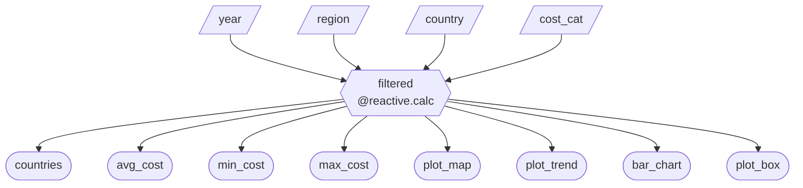

# App Specification Report: Global Cost of Healthy Diet Dashboard

## 1. Updated Job Stories

| # | Job Story | Status | Notes |
|---|-----------|--------|-------|
| J1 | As a policy analyst, I want to compare healthy diet costs across countries within a region so that I can identify which countries face relatively higher affordability challenges. | Implemented | Bar chart and map support regional comparisons |
| J2 | As a public health researcher, I want to examine trends over time in healthy diet costs so that I can assess whether affordability is improving or worsening between 2017 and 2024. | Implemented | Line chart displays cost over time by country |
| J3 | As a development practitioner, I want to explore the contribution of fruits and vegetables to total diet cost so that I can better understand potential drivers of high overall costs. | Implemented | Cost category filter enables component-level analysis |
| J4 | As a policymaker, I want to quickly identify high-cost countries and compare them across regions so that I can support evidence-based recommendations. | Revised | Box plot originally showed top 10; revised to show full distribution by region |
| J5 | As a health association member, I want to quickly help me visualize trends in healthy diet costs so that I can detect patterns, increases, or relative stability. | Implemented | Year slider enables temporal exploration across all charts |
| J6 | As a data analyst, I want to break down total diet cost into components so that I can better interpret cross-country differences. |  Pending M3 | Choropleth aggregation needs improvement for country-level cost breakdown |

---

## 2. Component Inventory

| ID | Type | Shiny Widget / Renderer | Depends On | Job Story |
|----|------|------------------------|------------|-----------|
| `year` | Input — Range slider | `ui.input_slider` | — | J2, J5 |
| `region` | Input — Dropdown | `ui.input_select` | — | J1, J4 |
| `country` | Input — Dropdown | `ui.input_select` | — | J1, J4 |
| `cost_cat` | Input — Radio buttons | `ui.input_radio_buttons` | — | J3, J6 |
| `filtered` | Reactive calc | `@reactive.calc` | `year`, `region`, `country`, `cost_cat` | J1–J6 |
| `n_countries` | Output — Value box | `@render.text` | `filtered` | J4 |
| `avg_cost` | Output — Value box | `@render.text` | `filtered` | J1, J4 |
| `min_cost` | Output — Value box | `@render.text` | `filtered` | J1, J4 |
| `max_cost` | Output — Value box | `@render.text` | `filtered` | J1, J4 |
| `plot_map` | Output — Choropleth map | `@render.ui` (Plotly HTML) | `filtered` | J1, J4 |
| `plot_trend` | Output — Line chart | `@render.ui` (Plotly HTML) | `filtered` | J2, J5 |
| `bar_chart` | Output — Bar chart | `@render.ui` (Plotly HTML) | `filtered` | J1, J3 |
| `plot_box` | Output — Box plot | `@render.ui` (Plotly HTML) | `filtered` | J4 |

## 3. Reactivity Diagram

**Notation:** Parallelograms = Inputs, Hexagons = `@reactive.calc`, Stadiums = Outputs (`@render.*`)
---
## 4. Calculation Details

### 4.1 Reactive Calculation

| Reactive calculation | Transformation performed | Outputs consuming it |
|---------------------|--------------------------|---------------------|
| `filtered()` | Takes the four sidebar inputs (`year`, `region`, `country`, `cost_cat`) and filters the full dataset by the selected year range, then optionally narrows by region, country, and cost category if any are not set to "All". Returns the filtered DataFrame. | `n_countries`, `avg_cost`, `min_cost`, `max_cost`, `plot_map`, `plot_trend`, `bar_chart`, `plot_box` |

### 4.2 Render Outputs

| Output | Renderer | Transformation performed |
|--------|----------|--------------------------|
| `n_countries` | `@render.text` | Takes the `filtered()` DataFrame and counts the number of distinct countries. |
| `avg_cost` | `@render.text` | Takes the `filtered()` DataFrame and computes the mean healthy diet cost (USD/day). |
| `min_cost` | `@render.text` | Takes the `filtered()` DataFrame and finds the lowest healthy diet cost (USD/day). |
| `max_cost` | `@render.text` | Takes the `filtered()` DataFrame and finds the highest healthy diet cost (USD/day). |
| `plot_map` | `@render.ui` | Takes the `filtered()` DataFrame, groups by region, computes the average cost per region, and renders a choropleth world map using Plotly. |
| `plot_trend` | `@render.ui` | Takes the `filtered()` DataFrame and plots healthy diet cost over time as a line chart, with each country shown as a separate colored line. |
| `bar_chart` | `@render.ui` | Takes the `filtered()` DataFrame, groups by region, computes the average cost per region, and displays it as a bar chart using Plotly. |
| `plot_box` | `@render.ui` | Takes the `filtered()` DataFrame and displays the distribution of healthy diet costs by year, colored by region, as a box plot. |

## 5. Complexity Enhancement: Clear Filters Button

A **Clear Filters** button has been added to the sidebar to allow users to quickly return all filters to their default state ("All" for dropdowns/radio buttons, full range for the year slider). This improves usability when users have applied multiple filters and want to start a fresh exploration without manually resetting each control.

**Implementation:** The reset button uses `ui.input_action_button( "Clear Filters")` in the sidebar and an `@reactive.effect` triggered by `input.reset()` that calls `ui.update_slider()`, `ui.update_select()`, and `ui.update_radio_buttons()` to restore defaults.

---

