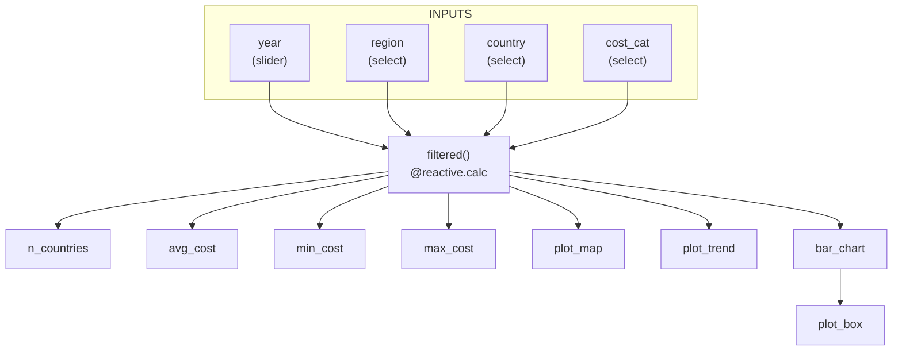

# App Specification Report: Global Cost of Healthy Diet Dashboard

## 1. Updated Job Stories

| # | Job Story | Status | Notes |
|---|-----------|--------|-------|
| J1 | As a policy analyst, I want to compare healthy diet costs across countries within a region so that I can identify which countries face relatively higher affordability challenges. | Implemented | |
| J2 | As a public health researcher, I want to examine trends over time in healthy diet costs so that I can assess whether affordability is improving or worsening between 2017 and 2024. | Implemented | |
| J3 | As a development practitioner, I want to explore the contribution of fruits and vegetables to total diet cost so that I can better understand potential drivers of high overall costs. | Implemented | |
| J4 | As a policymaker, I want to quickly identify high-cost countries and compare them across regions so that I can support evidence-based recommendations. | Implemented | |
| J5 | As a health association member, I want to quickly help me visualize trends in healthy diet costs so that I can detect patterns, increases, or relative stability. | Implemented | |
| J6 | As a data analyst, I want to break down total diet cost into components so that I can better interpret cross-country differences. | Implemented | |

---

## 2. Component Inventory

| ID | Type | Shiny Widget / Renderer | Depends On | Job Stories |
|----|------|------------------------|------------|-------------|
| `year` | Input – Slider | `ui.input_slider()` | — | J1, J2, J4, J5 |
| `region` | Input – Dropdown | `ui.input_select()` | — | J1, J3, J4, J6 |
| `country` | Input – Dropdown | `ui.input_select()` | — | J1, J2, J4 |
| `cost_cat` | Input – Dropdown | `ui.input_select()` | — | J3, J6 |
| `filtered()` | Reactive calc | `@reactive.calc` | `year`, `region`, `country`, `cost_cat` | J1, J2, J3, J4, J5, J6 |
| `n_countries` | Value box | `@render.text` | `filtered()` | J1, J4 |
| `avg_cost` | Value box | `@render.text` | `filtered()` | J1, J4, J6 |
| `min_cost` | Value box | `@render.text` | `filtered()` | J1, J4 |
| `max_cost` | Value box | `@render.text` | `filtered()` | J1, J4 |
| `plot_map` | Choropleth map | `@render.ui` , `px.choropleth()` | `filtered()` | J1, J4 |
| `plot_trend` | Line chart | `@render.ui` , `px.line()` | `filtered()` | J2, J5 |
| `bar_chart` | Bar chart | `@render.ui` , `px.bar()` | `filtered()` | J3, J6 |
| `plot_box` | Box plot | `@render.ui` , `px.box()` | `filtered()` | J2, J5, J6 |

## 3. Reactivity Diagram

---

## 4. Calculation Details

| Reactive calculation | Transformation performed | Outputs consuming it |
|---------------------|--------------------------|---------------------|
| `filtered()` | Takes the four sidebar inputs (`year`, `region`, `country`, `cost_cat`) and filters the full dataset by the selected year range, then optionally narrows by region, country, and cost category if any are not set to "All". Returns the filtered DataFrame. | `n_countries`, `avg_cost`, `min_cost`, `max_cost`, `plot_map`, `plot_trend`, `bar_chart`, `plot_box` |
| `n_countries` | Takes the `filtered()` DataFrame and counts the number of distinct countries. | Value box (text) |
| `avg_cost` | Takes the `filtered()` DataFrame and computes the mean healthy diet cost (USD/day). | Value box (text) |
| `min_cost` | Takes the `filtered()` DataFrame and finds the lowest healthy diet cost (USD/day). | Value box (text) |
| `max_cost` | Takes the `filtered()` DataFrame and finds the highest healthy diet cost (USD/day). | Value box (text) |
| `plot_map` | Takes the `filtered()` DataFrame, groups by region, computes the average cost per region, and renders a choropleth world map. | Choropleth map card |
| `plot_trend` | Takes the `filtered()` DataFrame and plots healthy diet cost over time as a line chart, with each country shown as a separate colored line. | Line chart card |
| `bar_chart` | Takes the `filtered()` DataFrame, groups by region, computes the average cost per region, and displays it as a bar chart. | Bar chart card |
| `plot_box` | Takes the `filtered()` DataFrame and displays the distribution of healthy diet costs by year, colored by region, as a box plot. | Box plot card |

