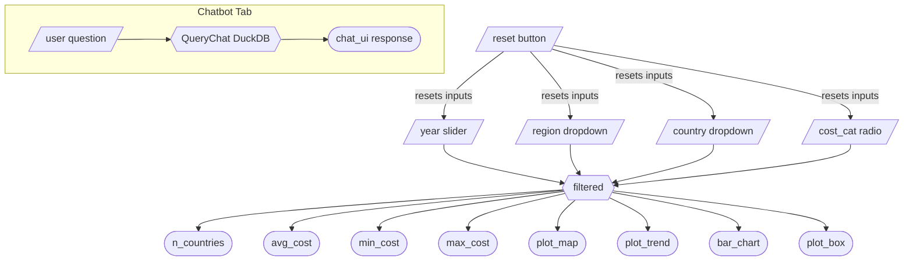

# App Specification Report: Global Cost of Healthy Diet Dashboard
## Milestone 4 — Final Release (v4.0.0)

---

## 1. Updated Job Stories

| # | Job Story | Status | Notes |
|---|-----------|--------|-------|
| J1 | As a policy analyst, I want to compare healthy diet costs across countries within a region so that I can identify which countries face relatively higher affordability challenges. | Implemented | Bar chart and choropleth map support regional and country-level comparisons |
| J2 | As a public health researcher, I want to examine trends over time in healthy diet costs so that I can assess whether affordability is improving or worsening between 2017 and 2024. |  Implemented | Line chart displays cost over time by country |
| J3 | As a development practitioner, I want to explore the contribution of fruits and vegetables to total diet cost so that I can better understand potential drivers of high overall costs. |  Implemented | Cost category filter enables component-level analysis |
| J4 | As a policymaker, I want to quickly identify high-cost countries and compare them across regions so that I can support evidence-based recommendations. | Implemented | Box plot shows full cost distribution by region; choropleth now supports country-level hover tooltips |
| J5 | As a health association member, I want to quickly visualize trends in healthy diet costs so that I can detect patterns, increases, or relative stability. | Implemented | Year slider enables temporal exploration across all charts |
| J6 | As a data analyst, I want to break down total diet cost into components so that I can better interpret cross-country differences. | Implemented | Choropleth updated to country-level aggregation with hover tooltips showing cost breakdown |
| J7 | As a non-technical stakeholder, I want to ask questions about the data in plain language so that I can extract insights without needing to operate the dashboard filters manually. | Implemented  | AI chatbot tab powered by Claude (Anthropic API) via querychat/chatlas; translates natural language questions into SQL queries against the dataset |

---

## 2. Component Inventory

| ID | Type | Shiny Widget / Renderer | Depends On | Job Story |
|----|------|------------------------|------------|-----------|
| year | Input — Range slider | `ui.input_slider` | — | J2, J5 |
| region | Input — Dropdown | `ui.input_select` | — | J1, J4 |
| country | Input — Dropdown | `ui.input_select` | — | J1, J4 |
| cost_cat | Input — Radio buttons | `ui.input_radio_buttons` | — | J3, J6 |
| reset | Input — Action button | `ui.input_action_button` | — | J1–J6 |
| filtered | Reactive calc | `@reactive.calc` | year, region, country, cost_cat | J1–J6 |
| n_countries | Output — Value box | `@render.text` | filtered | J4 |
| avg_cost | Output — Value box | `@render.text` | filtered | J1, J4 |
| min_cost | Output — Value box | `@render.text` | filtered | J1, J4 |
| max_cost | Output — Value box | `@render.text` | filtered | J1, J4 |
| plot_map | Output — Choropleth map | `@render.ui` (Plotly HTML) | filtered | J1, J4, J6 |
| plot_trend | Output — Line chart | `@render.ui` (Plotly HTML) | filtered | J2, J5 |
| bar_chart | Output — Bar chart | `@render.ui` (Plotly HTML) | filtered | J1, J3 |
| plot_box | Output — Box plot | `@render.ui` (Plotly HTML) | filtered | J4 |
| chat_ui | Output — Chat interface | `querychat.chat_ui()` | qc (QueryChat instance) | J7 |
| chat_server | Server — Chat logic | `querychat.chat_server()` | qc (QueryChat instance) | J7 |

---

## 3. Reactivity Diagram



*Notation: Parallelograms = Inputs, Hexagons = `@reactive.calc`, Stadiums = Outputs (`@render.*`)*

---

## 4. Calculation Details

### 4.1 Reactive Calculation

| Reactive calculation | Transformation performed | Outputs |
|---------------------|-------------------------|----------------------|
| `filtered()` | Takes the four sidebar inputs (`year`, `region`, `country`, `cost_cat`) and filters the full dataset by the selected year range, then optionally narrows by region, country, and cost category if any are not set to `"All"`. Returns the filtered DataFrame. | n_countries, avg_cost, min_cost, max_cost, plot_map, plot_trend, bar_chart, plot_box |

### 4.2 Render Outputs

| Output | Renderer | Transformation performed |
|--------|----------|--------------------------|
| n_countries | `@render.text` | Counts distinct countries in `filtered()`. |
| avg_cost | `@render.text` | Computes mean healthy diet cost (USD/day) from `filtered()`. |
| min_cost | `@render.text` | Finds the lowest healthy diet cost (USD/day) in `filtered()`. |
| max_cost | `@render.text` | Finds the highest healthy diet cost (USD/day) in `filtered()`. |
| plot_map | `@render.ui` | Groups `filtered()` by country (updated from region-level in M2), computes average cost per country, and renders a choropleth world map using Plotly. Country-level hover tooltips display the country name and average cost. |
| plot_trend | `@render.ui` | Plots healthy diet cost over time as a line chart from `filtered()`, with each country as a separate colored line. |
| bar_chart | `@render.ui` | Groups `filtered()` by region, computes average cost per region, displays as a horizontal bar chart using Plotly. |
| plot_box | `@render.ui` | Displays distribution of healthy diet costs by year, colored by region, as a box plot from `filtered()`. |

### 4.3 AI Chatbot 

The chatbot tab uses `querychat` and `chatlas` to connect the dashboard's dataset to Claude Haiku (Anthropic API). The chatbot queries the full underlying dataset independently.

| Component | Role | Description |
|-----------|------|-------------|
| `QueryChat` instance (`qc`) | Data bridge | Initialized once at app startup. Receives the full DataFrame, a table name for DuckDB (`"healthy_diet_data"`), a greeting message, a data description, and a system prompt defining chatbot behaviour. |
| `chatlas.ChatAnthropic()` | LLM client | Authenticates with the Anthropic API key and specifies the `claude-4-5` model. |
| `querychat.chat_ui()` | UI renderer | Renders the chat interface (message history + input box) in the chatbot tab. |
| `querychat.chat_server()` | Server logic | Handles user input: translates questions into SQL via the LLM, runs queries against DuckDB, and returns natural language responses. |

### 4.4 Data Pipeline: Parquet + DuckDB

The processed dataset is stored as `data/processed/cleaned_price_of_healthy_diet.parquet`.
On app startup, a DuckDB `CREATE VIEW` is opened over the parquet file.
All sidebar filters are applied as SQL `WHERE` clauses inside `filtered()` 
(@reactive.calc) before any data enters a pandas DataFrame, avoiding full 
in-memory loads on every filter change.

---

## 5. Changes from M2 to M4

| Area | M2 State | M4 Final State |
|------|----------|----------------|
| Choropleth map | Aggregated by region (one colour) | Aggregated by country with individual country-level hover tooltips showing country name and cost |
| Chatbot | Not present | New AI chatbot tab powered by Claude; supports natural language queries over the full dataset |
| Job story J6 | Pending — choropleth needed improvement | Resolved country-level map enables cost breakdown exploration |
| Job story J7 | Not defined | New — covers the AI chatbot use case |


---

## 6. Deployment & Usage

The app is deployed in two environments on **Posit Connect Cloud**:

| Branch | URL | Purpose |
|--------|-----|---------|
| `main` | Production URL | Stable release |
| `dev` | Development URL | Active development and testing |


**Environment variable required for chatbot:**

```
ANTHROPIC_API_KEY=<your Anthropic API key>
```

---

## 7. Limitations and potential improvements

| # | Limitation | Potential Improvement |
|---|------------|-----------------------|
| L1 | The choropleth map uses average cost across all years in the selected range; year-by-year animation is not supported. | Add a play button or animation to show cost evolution on the map over time. |
| L2 | The AI chatbot queries the full dataset independently of the sidebar filters; it does not reflect the user's current filtered view. | Pass `filtered()` state to the chatbot context so responses are consistent with the active dashboard view. |
| L3 | The chatbot is limited to data queries; it cannot explain chart interactions or guide users through the dashboard. | Extend the system prompt or add a separate help mode for dashboard navigation assistance. |

